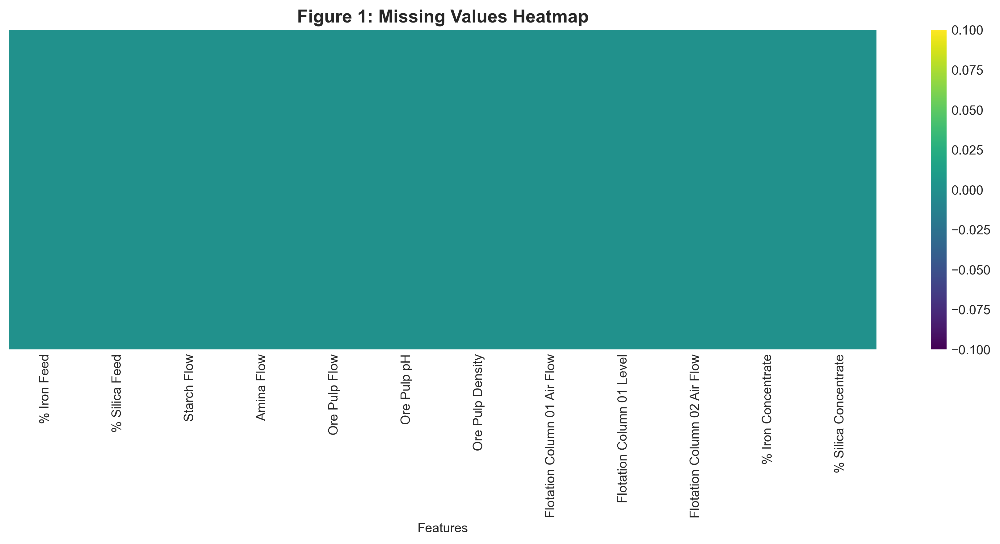
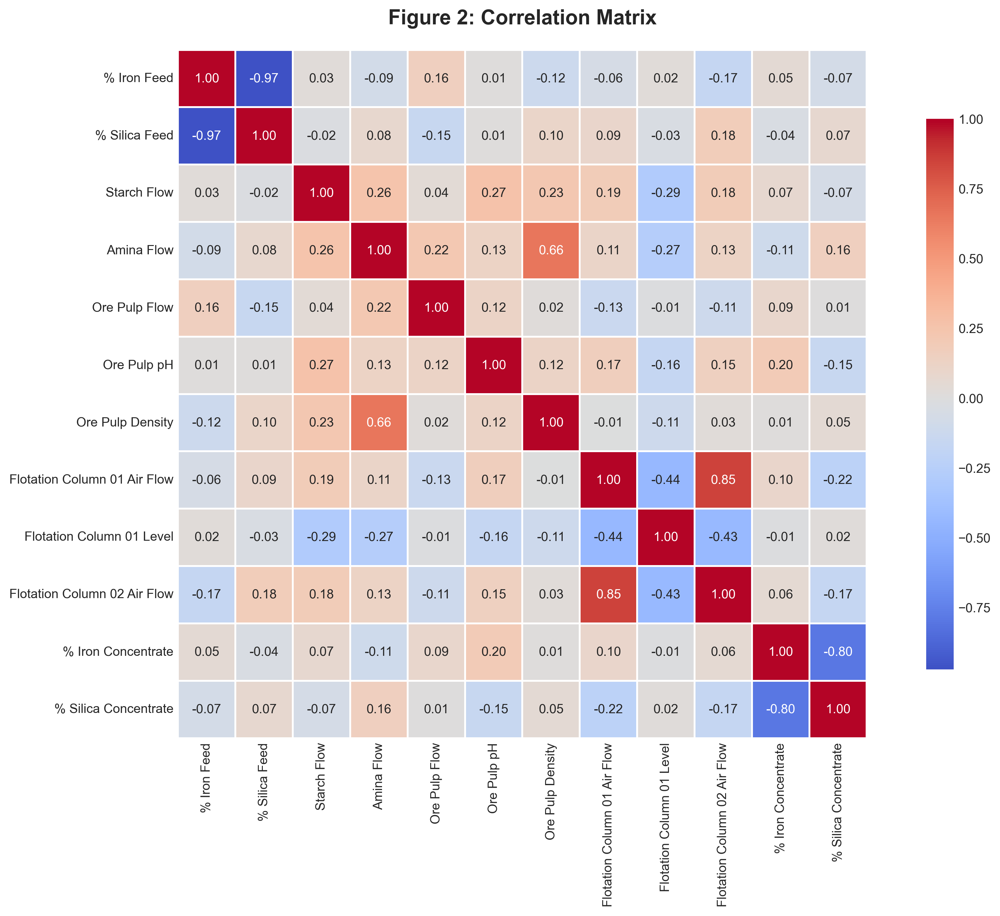
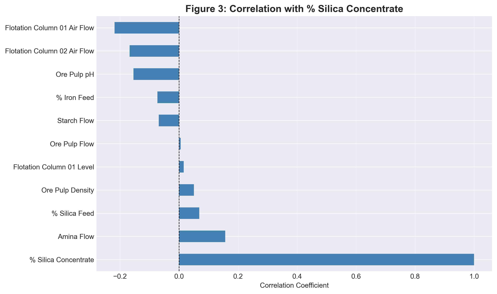
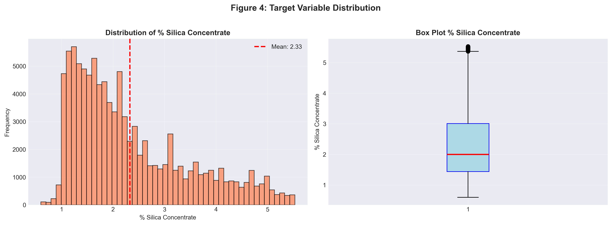
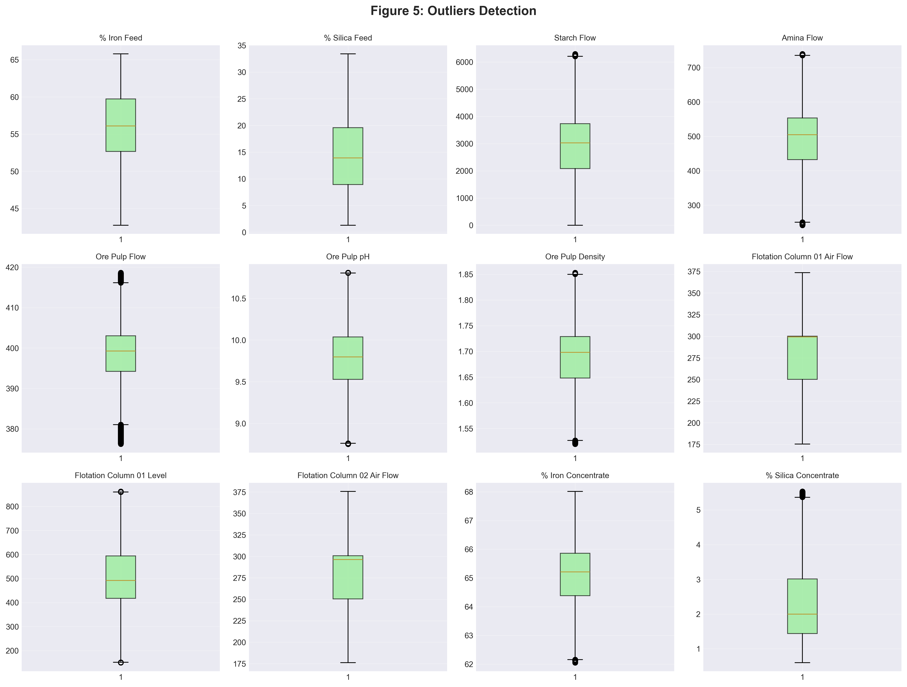
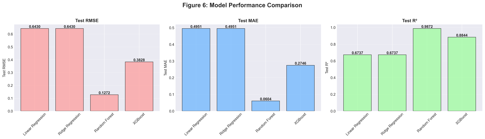
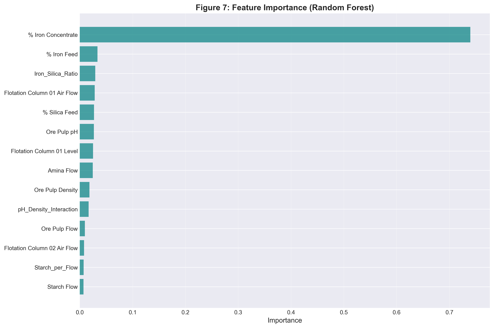
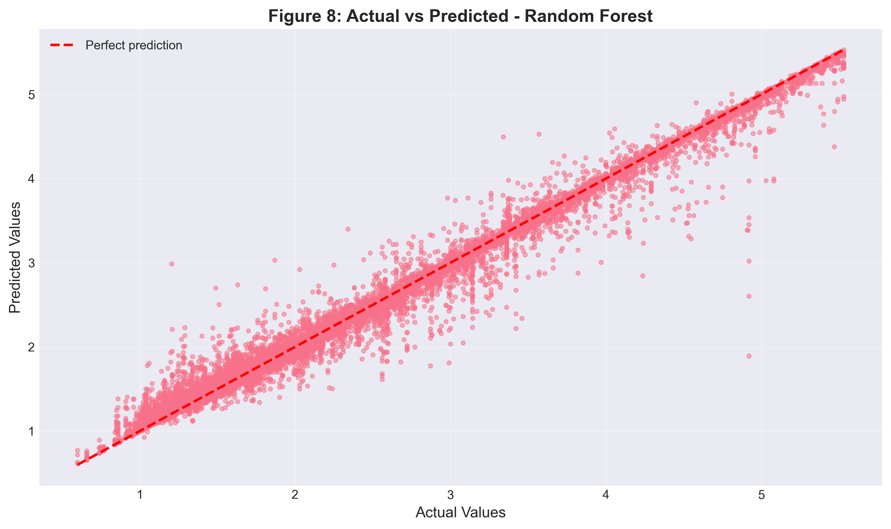
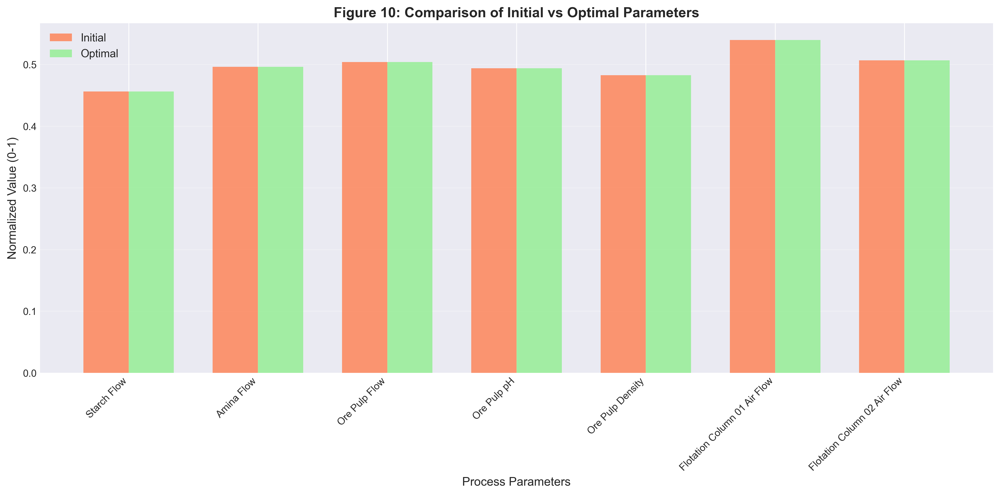

# 🏭 ML_PLC_Industry  
**Industrial Machine Learning with PLC–MATLAB OPC UA Communication**

## 📌 Project Overview
This project demonstrates how **industrial process data** can be used to train a **machine learning model** and how such models can be connected to **PLC systems** using **OPC UA**.

The main goal is to **predict product quality** in an industrial mining process and show how ML can support **automation and process optimization**.

---

## 🎯 Project Goals
- Communicate with PLC systems using **OPC UA (MATLAB side)**
- Train an **industrial ML model in Python**
- Predict **Silica percentage (Silica %)** in a flotation process
- Use real industrial data from **Kaggle**
- Demonstrate ML usage for **Industry 4.0**

---

## 📊 Dataset
**Source:** Kaggle  
**Dataset:** Quality Prediction in a Mining Process  
🔗 https://www.kaggle.com/datasets/edumagalhaes/quality-prediction-in-a-mining-process/data

### Dataset Description
- Real data from an **iron ore flotation plant**
- Time-series industrial sensor data
- The target variable is **Silica % in iron concentrate**
- Large dataset (millions of rows)

### Used Features (Inputs)
Selected process parameters:
- % Iron Feed  
- % Silica Feed  
- Starch Flow  
- Amina Flow  
- Ore Pulp pH  
- Ore Pulp Density  
- Flotation Columns Air Flow  

### Target (Output)
- **% Silica Concentrate**

---

## ⚙️ Data Preparation
Steps used in the notebook:
- Load CSV data
- Select relevant industrial features
- Remove unnecessary columns
- Random sampling (100,000 rows) to speed up training
- Train/Test split
- Basic data visualization and inspection

---

## 🤖 Machine Learning Approach
- **Problem type:** Regression
- **Goal:** Predict Silica % from process parameters
- **Language:** Python
- **Libraries:**
  - pandas
  - numpy
  - scikit-learn
  - matplotlib
  - seaborn

### Models Used
- Linear Regression  
- Random Forest Regressor  

Random Forest showed better performance for nonlinear industrial data.

---

## 📈 Model Evaluation
Evaluation metrics used:
- Mean Absolute Error (MAE)
- Mean Squared Error (MSE)
- R² Score

The trained model is suitable for **process monitoring** and **decision support**, not for direct closed-loop control.

---

## 🔌 PLC & OPC UA Concept
This project is designed to work together with:
- **PLC systems**
- **OPC UA communication**
- **MATLAB as OPC UA client**

---

## 📊 Exploratory Data Analysis (EDA)

### Figure 1: Missing Values Heatmap
This heatmap shows missing values in the dataset.  
All selected features have **no missing data**, so no imputation is required.

---

### Figure 2: Correlation Matrix
This matrix shows correlations between process variables and product quality.

Main observations:
- Strong negative correlation between **% Iron Feed** and **% Silica Feed**
- Strong negative correlation between **% Iron Concentrate** and **% Silica Concentrate**
- Strong positive correlation between **Flotation Column 01 Air Flow** and **Column 02 Air Flow**

---

### Figure 3: Correlation with % Silica Concentrate
This chart shows how each feature correlates with the target variable.

Key points:
- **Amina Flow** has the strongest positive correlation
- **Air Flow parameters** have negative correlation
- Most variables have weak to moderate influence

---

## 📈 Target Variable Analysis

### Figure 4: % Silica Concentrate Distribution
The histogram and boxplot show the distribution of the target variable.

Observations:
- Mean value is around **2.3**
- Data is slightly right-skewed
- Some outliers are present

---

## ⚠️ Outliers Analysis

### Figure 5: Outliers Detection
Box plots for all features show the presence of outliers.  
Outliers are expected in industrial process data and were **not removed** to keep realism.

---

## 🤖 Model Performance

### Figure 6: Model Performance Comparison
Comparison of regression models using:
- RMSE
- MAE
- R² Score

Results:
- **Random Forest** shows the best performance
- Linear and Ridge regression perform worse on nonlinear data

---

### Figure 7: Feature Importance (Random Forest)
This plot shows which features are most important for prediction.

Key insight:
- **% Iron Concentrate** is the most influential feature
- Process parameters like air flow and pH also contribute

---

### Figure 8: Actual vs Predicted Values
This scatter plot compares real and predicted values.

- Points close to the diagonal line mean good predictions
- Random Forest shows strong accuracy

---

### Figure 9: Residuals Analysis
Residual plots show:
- Errors are centered around zero
- Residuals are approximately normally distributed
- No strong bias is visible

---

## ⚙️ Process Optimization

### Figure 10: Initial vs Optimal Parameters
This chart compares initial process settings with optimized values suggested by the model.

Purpose:
- Support **operator decision-making**
- Not intended for direct automatic control

---

### 📁 Project Structure
ML_PLC_industry/
├── ML_PLC_Jupyter.ipynb   # Main ML notebook
├── README.md              # Project documentation
└── data/                  # Dataset (not included)

